# OpenLara GBA Asset Viewer

Put your own 3D models on a Game Boy Advance. Drop a `.glb`, `.dae`, `.obj` or
`.fbx` into a folder, double-click one file, and you get a `.gba` ROM that
displays them textured, animated, and rotatable on the hardware.

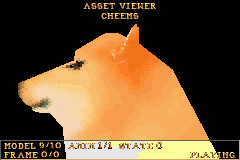

It is built on [OpenLara](https://github.com/XProger/OpenLara), XProger's open-source Tomb Raider engine. 
This project **never writes into your OpenLara checkout**: 
it mirrors the sources into a work folder of its own, lays its viewer on top, and builds there.
Point it at a clean clone and the clone stays clean.

Disclaimer: AI was used to help put in phrases the technical parts of this readme file.

---

## Controls

| Input | Action |
|---|---|
| Tap Left / Right | start spinning that way; tap again to stop <br>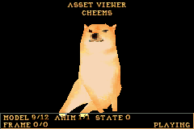 |
| Hold Left / Right | turn by hand, after about a quarter second <br>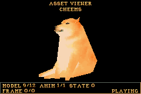 |
| Up / Down | pitch <br>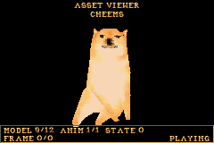 |
| Select + Left / Right | roll <br> |
| Select + Up / Down | zoom in / out <br>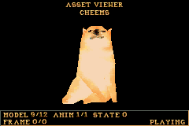 |
| L / R | previous / next model <br>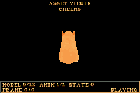 |
| Start<br>Select + Start | next animation<br>previous animation <br>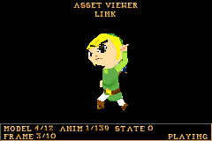 |
| A | play / pause <br>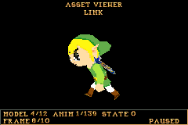 |
| Select + A | pause, then step one frame <br>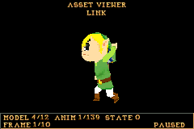 |
| B | face the camera again; zoom and vertical offset reset <br>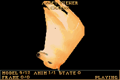 |
| Select alone | show / hide the control help <br> |
| Select + L / R | move the model up / down the screen <br>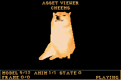 |

Animations are listed by their native `STATE` id, no `IDLE` or `WALK` names are invented for them.

---

## What you need

| | | |
|---|---|---|
| **OpenLara** | a checkout of <https://github.com/XProger/OpenLara> | read-only; nothing is written to it |
| **devkitPro** | the `gba-dev` package group | devkitARM, libgba, libtonc and maxmod |
| **Python** | 3.10 or newer, with [Pillow](https://pypi.org/project/Pillow/) | the converter and the build driver |
| **GNU make** | any recent version | devkitPro ships one on Windows |

Windows, Linux and macOS all work. One driver, `scripts/build_rom.py`, does the
whole job; `BUILD_ROM.bat` and `build_rom.sh` are thin wrappers around it so
that either platform has something to double-click or run. The two produce
byte-identical ROMs.

### Getting OpenLara

```bash
git clone https://github.com/XProger/OpenLara.git
```

Any recent revision should do. What matters is that the checkout contains
`src/platform/gba` and `src/fixed` — that is the GBA port and the shared
fixed-point engine. You do **not** need to build OpenLara yourself, and you do
not need any Tomb Raider game data to use this viewer with your own models.

### Getting devkitPro

Install the [devkitPro
updater](https://github.com/devkitPro/installer/releases), then select the
**gba-dev** group. On a system that already has `dkp-pacman`:

```bash
dkp-pacman -S gba-dev
```

The installer sets `DEVKITPRO` and `DEVKITARM` for you. The Makefile stops with
a clear message if `DEVKITARM` is unset, and links against `-ltonc -lmm`, both
of which come with that group.

### Getting Python

Python 3.10+ from python.org or the Microsoft Store, then:

```bash
pip install pillow
```

Pillow decodes the textures your models reference and packs them into the
engine's 256×256 atlas pages. Without it the converter stops with a message
saying so.

---

## Setting up

```bash
git clone https://github.com/<you>/OpenLara_GBA_Asset_Viewer.git
cd OpenLara_GBA_Asset_Viewer
copy settings.example.json settings.json
```

Open `settings.json` and set `openlara` to your checkout — the folder that holds
`src/platform/gba`:

```json
{
  "openlara": "C:\\code\\OpenLara",
  "models": "models",
  "roms": "roms",
  "work": "build"
}
```

JSON wants each backslash of a Windows path doubled. Forward slashes work too
and avoid the question.

## Building

**Windows:** double-click `BUILD_ROM.bat`.
**Linux and macOS:** `./build_rom.sh`.

Either one converts everything in `models/`, compiles the ROM, verifies it, and
leaves it in `roms/openlara-asset-viewer-custom.gba`. A fresh clone ships one
model — the demo dog — so the first build works before you have configured
anything but the OpenLara path.

Both accept a *different* folder of models, to build from it without touching
`models/`: drop the folder onto the `.bat`, or pass it to the `.sh`.

Both are wrappers around `scripts/build_rom.py`, which you can call directly:

```bash
python scripts/build_rom.py --openlara ~/code/OpenLara --models ~/my-models
python scripts/build_rom.py --clean          # throw the work folder away first
```

If your devkitPro is somewhere its installer did not put it and `DEVKITPRO` is
unset, add a `"devkitpro"` key to `settings.json` pointing at the folder that
holds `devkitARM/gba_rules`.

---

## Adding your own models

Drop files into `models/`. One level of subfolders is searched too, because a
COLLADA file usually travels as a folder with its textures beside it.

Four formats are read, and all four produce the same structures downstream:

| Format | Reader |
|---|---|
| glTF 2.0 / GLB | `scripts/gltf_reader.py` |
| COLLADA `.dae` | `scripts/collada_reader.py` |
| Wavefront `.obj` + `.mtl` | `scripts/obj_reader.py` |
| FBX (ASCII) | `scripts/fbx_reader.py` |

Order, names and per-model options come from an optional `models/pack.json`.
Without one, the folder is simply scanned:

```json
{
  "defaults": { "frame_rate": 2, "scale": "auto" },
  "models": [
    { "file": "hero.glb",  "name": "HERO", "rotate": [90, 0, 0] },
    { "file": "crate.glb", "name": "CRATE" }
  ]
}
```

`rotate` is for exports that stayed Z-up: without it the model lies on its side.
The converter prints each model's rest dimensions so a mistake is obvious, but
it does not guess — a quadruped is honestly longer than it is tall.

Every key is optional. These are all of them:

| Key | Default | What it does |
|---|---|---|
| `name` | the file name | the title shown on screen, 23 characters at most |
| `slot` | position in the list | where it lands in the catalogue, 0 to 190 |
| `scale` | `"auto"` | `auto` grows a model under 64 units to one sector (1024); otherwise a number |
| `frame_rate` | `2` | ticks between resampled keyframes; 1 is 30 Hz, 2 is 15 Hz |
| `rotate` | `[0, 0, 0]` | degrees X, Y, Z applied before anything else |
| `flip_winding` | `"auto"` | force the facing when a part shows its inside |
| `double_sided` | `"auto"` | `auto` repairs the winding and keeps one face per triangle, doubling only surfaces that cannot be oriented at all; `true` doubles everything, `false` never does |

`defaults` sets `frame_rate` and `scale` for every model at once.

### What the target can do

| Subject | Rule |
|---|---|
| Materials | three: flat colour, opaque textured, colour-keyed textured |
| Joints | 32, addressed through a 32-bit visibility mask |
| Vertices | 255 per mesh block; a bigger mesh is split across extra joints at zero offset |
| Faces | 1920 per frame; refused past that, warned at 80 % |
| Textures | 1536 records, atlas pages of 256×256 |
| UV span | ≤ 127 texels per face, or the engine clips it silently |
| Scale | no per-joint scale exists, so any in the chain is baked into the vertices |
| Animated scale | impossible; the stretch is dropped and reported, the rest of the motion kept |

Anything the engine cannot express is reported as an error rather than quietly
dropped: ngons, sparse accessors, mirrored matrices.

### The parts that took the longest to get right

These are worth knowing about, because they are where a converted model goes
wrong in ways that look like something else:

**Which side of a face is the front** is read, never guessed. Normals first —
glTF `NORMAL`, COLLADA `<input semantic="NORMAL">`, OBJ `vn`, FBX
`LayerElementNormal` — then the signed volume when the shell is closed, which is
a fact rather than an estimate. A file that is both open and stripped of its
normals says nothing about its facing; that is reported in the build log, and
`flip_winding` in `pack.json` is where you write the answer. Measuring a piece's
outside from its shape turned car wheels and locks of hair inside out, so it is
not done at all.

**A skeleton is posed a vertex at a time.** The engine transforms a mesh block
with one matrix, which suits a model built as separate rigid limbs and tears one
whose triangles straddle its joints — and every DS or GBA era character is the
second kind. A quarter of Link's triangles have corners on two different bones.
So the viewer captures each bone's matrix in model space, moves every vertex by
the matrix of *its own* bone into a copy of the block held in RAM, and lets the
engine draw that copy as ordinary rigid geometry. A vertex a source shares
between several bones keeps every influence it names, up to four, blended by
weight.

**Seams cannot open**, because a vertex is computed once from one rest position:
two blocks that share it land on exactly the same point. Before that, each block
rounded its copy to the format's four-unit lattice in its own frame, and two
frames round two ways — a one-pixel crack along every seam, invisible until you
zoom in.

---

## Checking a conversion

The converter is not the last word; several tools exist to disagree with it.

```bash
# Replay a converted body the way the engine walks it, and compare it to the source
python scripts/check_custom_body.py --glyphs <TITLE.PKD> model.glb

# Draw a converted model offline, through the engine's own pipeline
python scripts/preview_custom_body.py --glyphs <TITLE.PKD> model.glb --out preview.png

# Read the same model through two formats and diff the result
python scripts/compare_sources.py hero.dae hero.fbx

# Generate a diagnostic model: six faces, two joints, an animation
python scripts/make_test_model.py --output models/test_cube.glb

# And one that exercises weighted skinning, which no ripped model does
python scripts/make_test_model.py --output models/test_skin.glb --skinned
```

`tools/viewer_tour_runner.c` is the one that looks at what a GBA would actually
show: it loads the ROM in **libmGBA**, frames every model to the same size,
walks all the way round it, and dumps the real Mode 4 page. It links against a
libmGBA you build yourself:

```bash
gcc -O2 -o viewer_tour_runner tools/viewer_tour_runner.c   -DM_CORE_GBA -DENABLE_VFS -DENABLE_VFS_FD -DENABLE_DIRECTORIES   -DBUILD_STATIC -DNDEBUG -D_GNU_SOURCE   -DHAVE_STRDUP -DHAVE_STRNDUP -DHAVE_SETLOCALE -DHAVE_VASPRINTF   -I<mgba-build>/include -I<mgba-source>/include <mgba-build>/libmgba.a -lm
# Windows also needs -lshlwapi -lole32 -luuid -lws2_32

viewer_tour_runner ROM OUT_DIR MODEL_COUNT [COVERAGE_PERCENT] [ANIM_FRAMES]
```

`COVERAGE_PERCENT` is how much of the screen the model should fill before the
captures are taken, so every model is judged at the same size; `ANIM_FRAMES`
steps a fixed number of frames into the animation, so two ROMs can be compared
on the same pose. It also dumps raw palette indices, which is what separates a
genuine crack from black paint — the viewer's background is palette index 0 and
no texel is ever assigned to it.

---

## How it is put together

```text
BUILD_ROM.bat            one-click build, Windows
build_rom.sh             the same, Linux and macOS
settings.example.json    copy to settings.json, set the OpenLara path
models/                  your models; only the demo one is in git
overlay/                 the viewer, and the four donor files it hooks into
scripts/                 converter, build driver, verifiers
tools/                   the emulator runner
docs/                    controls, asset notice
```

The build mirrors the OpenLara sources into `build/`, copies `overlay/` over the
mirror, applies a few compile fixes that this devkitARM needs — each idempotent,
each reporting if it no longer applies because OpenLara moved on — and builds
there. Four files of the donor are involved:

```text
overlay/src/fixed/common.cpp                    keeps game data out of the binary
overlay/src/platform/gba/Makefile               the ASSET_VIEWER target
overlay/src/platform/gba/main.cpp               routes init/update/render to the viewer
overlay/src/platform/gba/asset_viewer.{cpp,h}   the viewer itself
```

---

## Licence and assets

OpenLara is © Timur "XProger" Gagiev under the
[BSD 2-Clause](https://github.com/XProger/OpenLara/blob/master/LICENSE) licence;
the four overlay files above are derived from it and carry the same terms.

**No Tomb Raider data is redistributed here**, and none is needed to view your
own models. Loading Tomb Raider models instead requires your own copy of the
game — see `docs/ASSET_NOTICE.md` for exactly which files stay outside.

The demo model (`models/cheems.glb`) is made by "feverpepper" on Sketchfab (https://sketchfab.com/3d-models/cheems-912a6ee6504b4b7a8b0226000e01cdea), I just decimated the geometry a bit so it can fit better.
